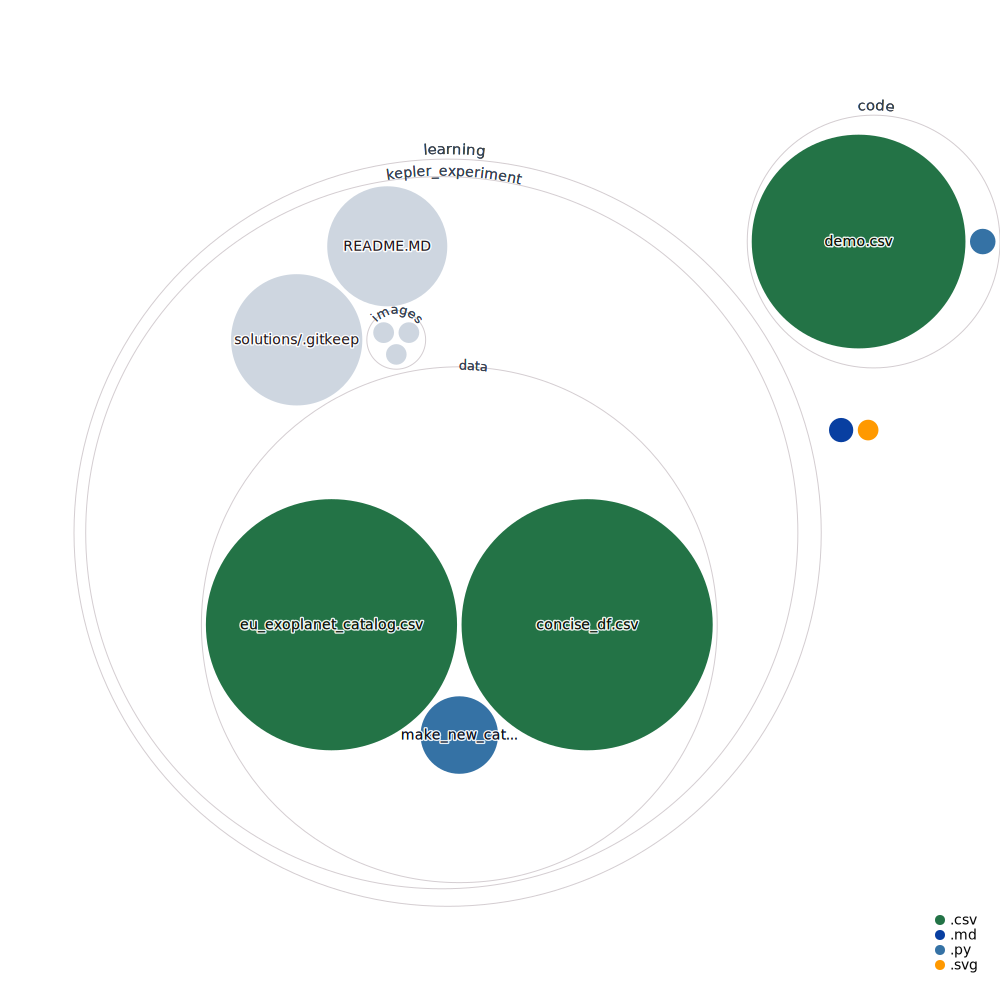

# sunnyhills
[](https://pypi.python.org/pypi/ansicolortags/)


## Installing the `sunnyhills` python package

* `$ python setup.py develop`, when executed under the directory of this repository, will install the `sunnyhills` python package to
your computer's working path.  It'll also let you edit code in `/sunnyhills/`,
and then import it from anywhere else on your computer.

* To setup the package locally for conda usage, first go to the conda environment prompt, then execute ```conda install conda-develop```. Then, navigate to this directory within the command line, and once you're in it, execute ```conda develop .```. After you've done this, execute ```pip install -e .``` and you should be good to go. If you ever want to *uninstall* the sunnyhills repo, you can use ```pip uninstall .``` or ```conda develop -u .``` (all thanks to this [link](https://web.archive.org/web/20220302135120/https://stackoverflow.com/questions/49474575/how-to-install-my-own-python-module-package-via-conda-and-watch-its-changes))

    * Note that you may need to open vscode from the andaconda prompt within the activated environment for the changes to work (i.e. execute ```code```)

## Miscellaneous Notes
* **Colab Setup:** 1). ```pip3``` install ```wotan```, ```transitleastsquares```, and ```lightkurve``` 2). install fortan  via  ```sudo apt-get install gfortran``` 3). Update ```matplotlib``` version via ```pip3 install 'matplotlib==3.3.1'``` 

## About this repository

