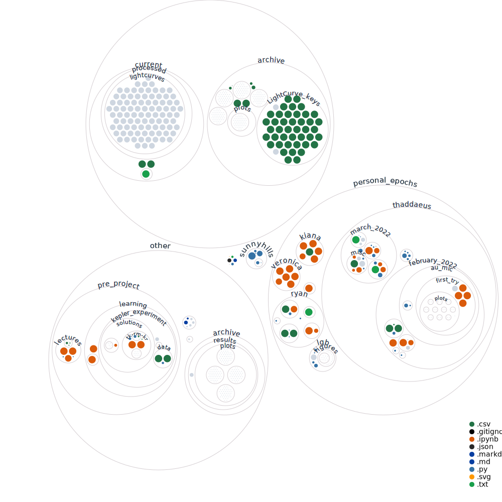

# sunnyhills

## Misc. Notes

* Set matplotlib stylesheet: ```plt.style.use(style_string_name)``` (see
  https://matplotlib.org/stable/gallery/style_sheets/style_sheets_reference.html
... ggplot is really nice)

* Set matplotlib default font family to serif:
  ```plt.rcParams['font.family']='serif'```

## Installing the `sunnyhills` python package

`$ python setup.py develop` will install the `sunnyhills` python package to
your computer's working path.  It'll also let you edit code in `/sunnyhills/`,
and then import it from anywhere else on your computer.

## About this repo

